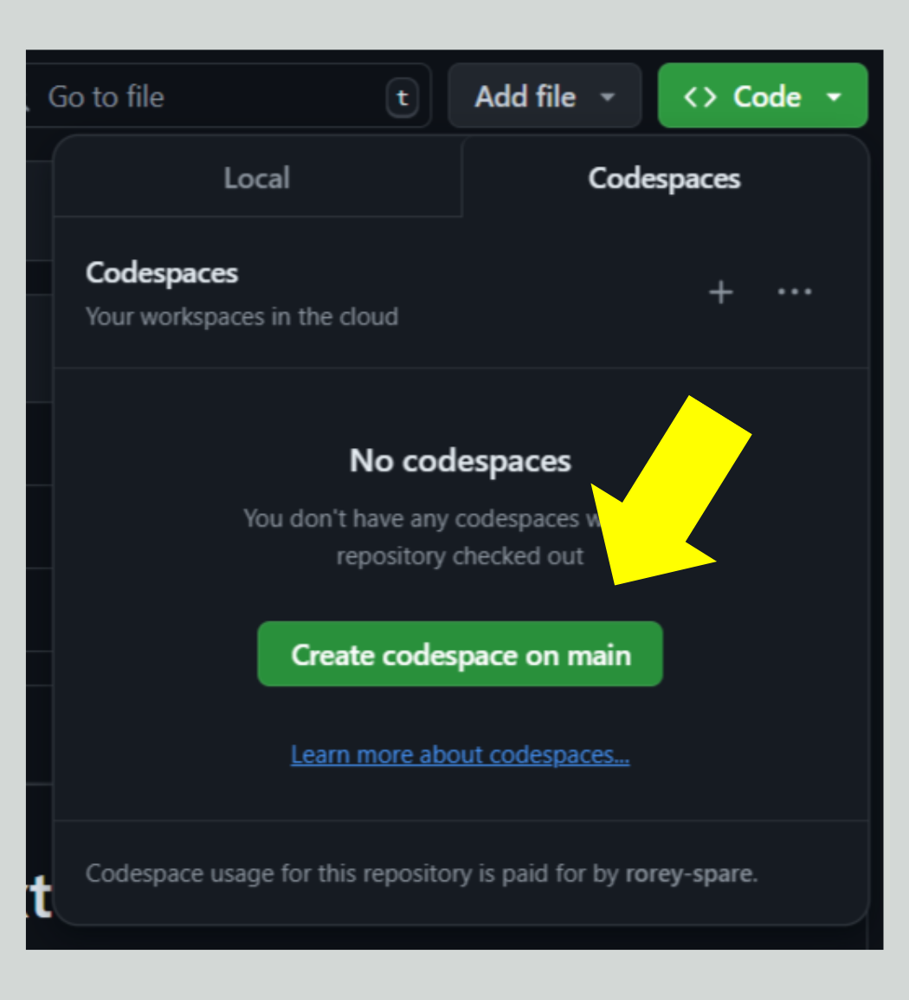
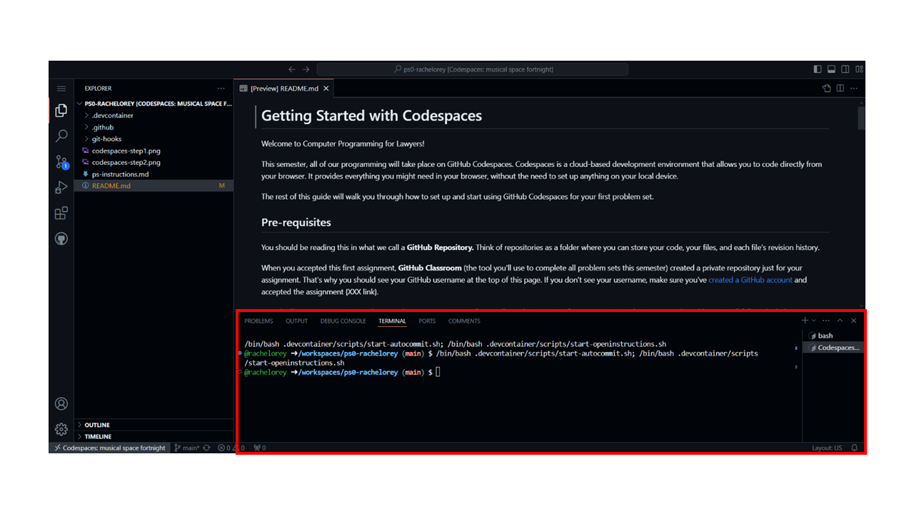

# Getting Started with Codespaces

Welcome to Computer Programming for Lawyers!

This semester, all of our programming will take place on GitHub Codespaces. Codespaces is a cloud-based development environment that allows you to code directly from your browser. It provides everything you might need in your browser, without the need to set up anything on your local device.

The rest of this guide will walk you through how to set up and start using GitHub Codespaces for your first problem set.

## Pre-requisites

You should be reading this in what we call a **GitHub Repository.** Think of repositories as a folder where you can store your code, your files, and each file's revision history. 

GitHub allows you to create a Codespace, the programming interface we'll use this semester, for any repository. That means each problem set will follow the below steps:
1. We'll send you a link to the problem set assignment, which is housed in GitHub Classroom.
2. Once you accept the assignment, GitHub will create a personalized, private repository that includes assignment instructions.
3. You'll then create a Codespace in that private repository. You'll complete the assignment in the Codespace you've just created.
4. Once you complete the assignment in Codespaces, you'll save your changes (through a process called **Committing** and **Pushing** that we describe below) and then **Submit**. 

## Terms and Information to Know

### Committing and pushing
**Committing** and **pushing** are how you can add the changes you made in Codespaces to your GitHub repository. That way your instructor and/or teammates can see your latest work when you’re ready to share it. Think of it like saving a file, and then uploading it to where it needs to go. 

We've set up the first few problem sets to automatically commit and push any changes you make in Codespaces to your repository every 5 minutes. That not only helps us see how you've gone about solving the problem, but it gives you time to develop a habit for commmiting & pushing when that might now feel unfamiliar.

Typically, you make a commit when you have made changes to your project that you want to “checkpoint.” You can also add a helpful **commit message** to remind yourself or your teammates what work you did (e.g. “Added a README with information about our project”).

Once you have a commit or multiple commits that you’re ready to add to your repository, you can use the push command to add those changes to your remote repository. Committing and pushing may feel new at first, but we promise you’ll get used to it. We'll show you how to commit and push in Codespaces a little later on.

### Repositories 
We mentioned repositories already, they are where your project work happens, but let’s talk a bit more about the details of them! As you work more on GitHub you will have many repositories which may feel confusing at first. Fortunately, your ["GitHub dashboard"](https://docs.github.com/en/github/setting-up-and-managing-your-github-user-account/about-your-personal-dashboard) helps to easily navigate to your repositories and see useful information about them. Make sure you’re logged in to see it!

Repositories also contain **README**s. You can add a README file to your repository to tell other people about your project. We are using this README to communicate how to learn GitHub with you, and we'll include problem set instructions there throughout the course.

## How to Create a Codespace for Any Repository

How to create a Codespace:
1. Click the green "Code" button pictured here:

2. In the menu that opens, select "Create codespace on main": 

3. That should open a new tab. It will take a few minutes to load.

Note: If you are creating a Codespace on a repository that you don't have "write access" to (aka, the permission to edit), you may need to create a copy of that repository that you can edit. 

To do that, follow the instructions in the [README.md](README.md).

# Codespaces Tutorial
The rest of this document walks you through what you see when you open a Codespace. We'll be spending a lot of time here this semester, so read closely. If you've followed the instructions so far, you should be looking at a Codespace right now. 

## 1. The coding space

The center of the screen is what we'll call the coding space. This is the space where you'll be able to view and edit files – where the coding happens!

### 2. The File Explorer

This is your file explorer. It shows all the files pertaining to your Codespace. In most cases, they reflect exactly what's in the GitHub repository you used to create this Codespace.

> [!WARNING]
Don't edit the ".devcontainer" or "git-hooks" folders. We've set those up to make your programming easier. If you edit or delete them, it could impact your ability to complete or submit your assignment. 

### 3. The Navigation Pane

This is your navigation pane. You can largely ignore this for now, we’ll get more comfortable with it throughout the course.

You can click the top document icon to get back to the file explorer.

### 4. The Terminal

This area serves multiple purposes, but we’ll primarily be using it to access your **Terminal**. Think of the terminal as a place where you tell the development environment (Codespaces) what to do: create new files, execute programs, and more.

### 5. Full Interface

Now, take a look at your full screen. Everything you see is the interface where you can see the file explorer, navigation pane, coding space, and terminal together. Look around and get comfortable. 

## Next Steps

Now that you've gotten acquainted, let's try interacting with the terminal (remember, that's the section taking up the bottom middle and right of your screen). 

Here are some commands that will come in handy:

- `code yourfile.md` - Open a file in the coding space.
- `touch newfile.txt` - Create a new file.
- `git add .` - Stage changes for commit.
- `git commit -m "Add new content to the tutorial"` - Commit your changes with a message.
- `git push` - Push your changes to GitHub.
